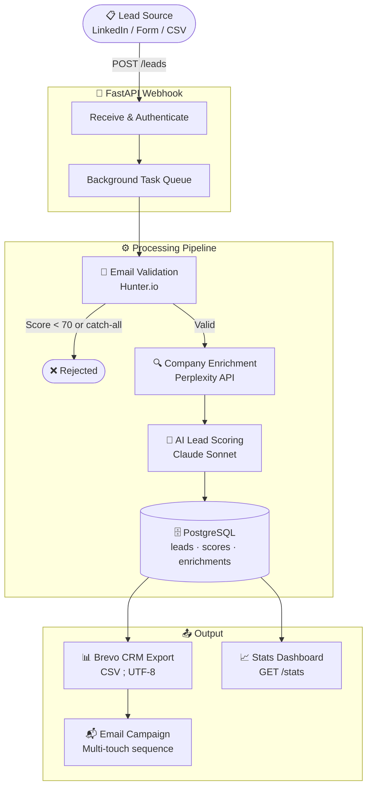

# NurtureAI — Autonomous B2B Lead Qualification Pipeline

> Autonomous pipeline that transforms raw contact data into scored, enriched, CRM-ready leads — with zero manual intervention.

**Webhook → Validate → Enrich → Score (AI) → PostgreSQL → Brevo CRM**

---

## Architecture

---

## Repository Structure
